# 📘 RC ISMS: School Admin User Manual

[← Back to Index](index.md)

## **Phase 1: System Access & Initial Setup**

### **1. Login Page**

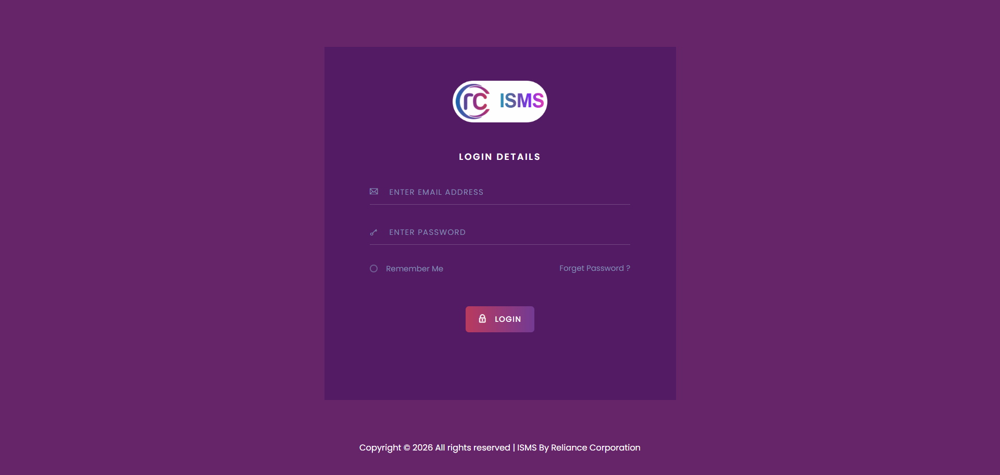

*   **Navigation:** Launch the RC ISMS URL.
*   **Action:** Enter your registered **Email Address** and **Password**.
*   **Options:** 
    *   **Remember Me:** Check this to stay logged in on this browser.
    *   **Forget Password:** Click this to enter your email and receive a reset link.
*   **Button:** Click `LOGIN` to access the portal.

### **2. School Admin Dashboard**

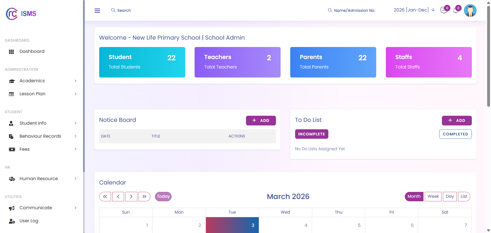

*   **Overview:** Your landing page shows total counts for **Student, Teachers, Parents, and Staffs**.
*   **Widgets:** View the **Notice Board** and manage your personal **To Do List** (switch between Incomplete/Completed).
*   **Calendar:** View the school schedule by Month, Week, Day, or List. Click on any **Date Box** to quickly add a scheduled event.
*   **Top Bar Tools:** 
    *   **Academic Year Switcher:** Use the dropdown (e.g., 2026 [Jan-Dec]) to view historic or future data.
    *   **Profile/Avatar (Top Right):** Click this to View/Edit Profile, Change Password, or Logout. This remains available on every screen.
    *   **Notifications & Messages:** Icons for alerts and internal communications.

### **2.5 General & Academic Year Settings**

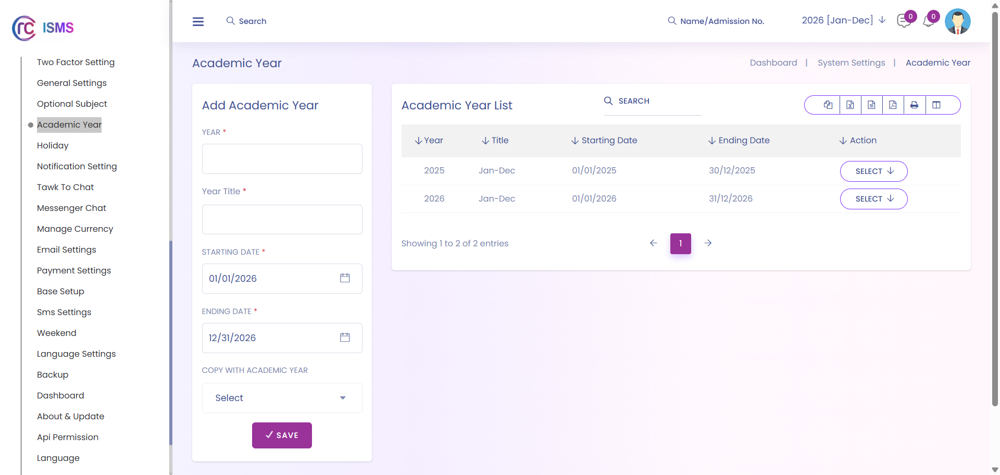

*   **School Info:** Navigate to `Settings Section > General Settings` to manage school identity.
*   **Academic Years:** Navigate to `Settings Section > General Settings > Academic Year`. 
*   **Action:** Click `Add Academic Year`. Enter the **Year** (e.g., 2026), **Year Title** (e.g., Jan-Dec), and **Starting/Ending Dates**. 
*   **Copy Feature:** Use the "Copy with Academic Year" dropdown to carry over settings from previous years.

---

## **Phase 2: Academic & HR Infrastructure**

### **3. Managing Sections**

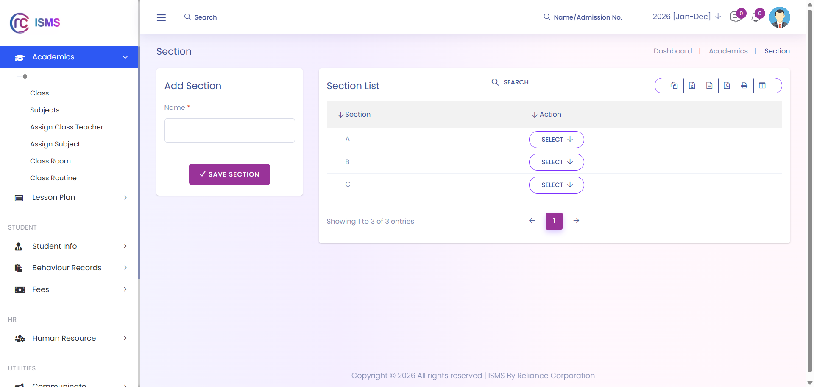

*   **Navigation:** `Administration > Academics > Section`.
*   **Action:** In the "Add Section" panel, enter the **Name** (e.g., A, B, C). 
*   **Manage:** View the **Section List** on the right to edit or delete existing entries via the `SELECT` dropdown.

### **4. Managing Classes**

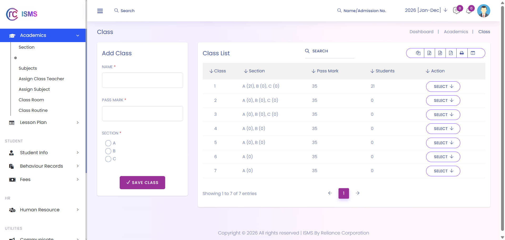

*   **Navigation:** `Administration > Academics > Class`.
*   **Action:** Enter the **Name** and **Pass Mark**.
*   **Linking:** Under the **Section** list, check the boxes for all sections that apply to this class. Hit `SAVE CLASS`.

### **5. Managing Subjects**

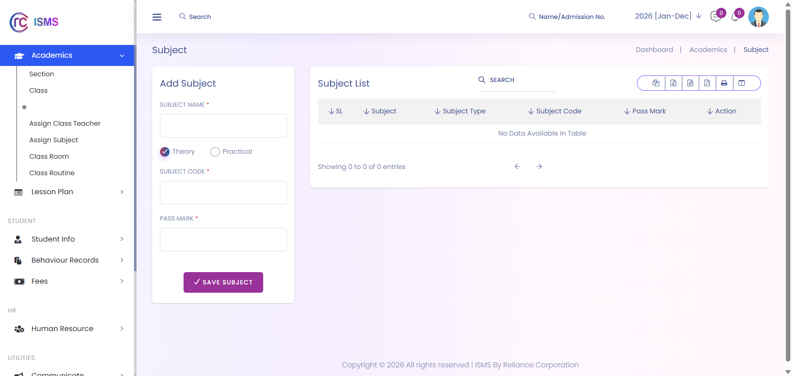

*   **Navigation:** `Administration > Academics > Subjects`.
*   **Action:** Enter **Subject Name**, **Subject Code**, and **Pass Mark**.
*   **Type:** Choose the **Theory** or **Practical** radio button.

### **6. Adding Staff & Teachers**

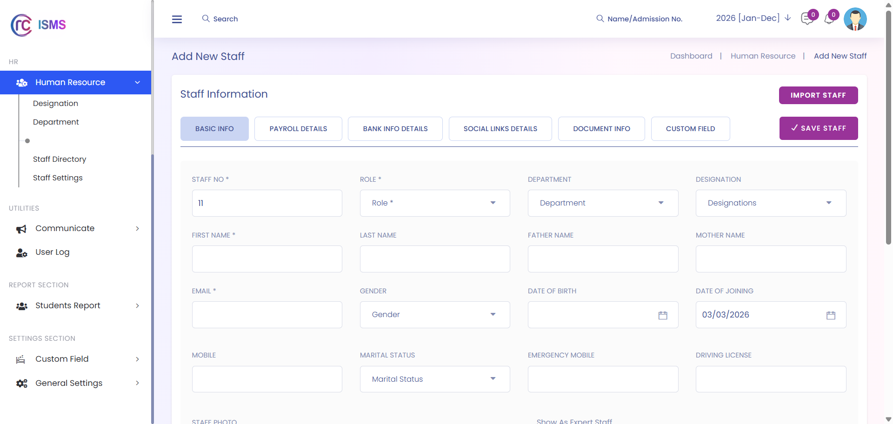

*   **Navigation:** `HR > Human Resource > Add Staff`.
*   **Role Selection:** Select **Teacher** from the Role dropdown to grant classroom management permissions.
*   **Account Logic:** Entering a valid **Email** will automatically generate a user account for the teacher.
*   **Dropdown Data:** Manage the options for **Department** and **Designation** via their respective submenus under the `Human Resource` menu.
*   **Tabs:** Fill in **Basic Info, Payroll, Bank Details, Social Links, and Documents**.

### **7. Assigning Class Teachers**

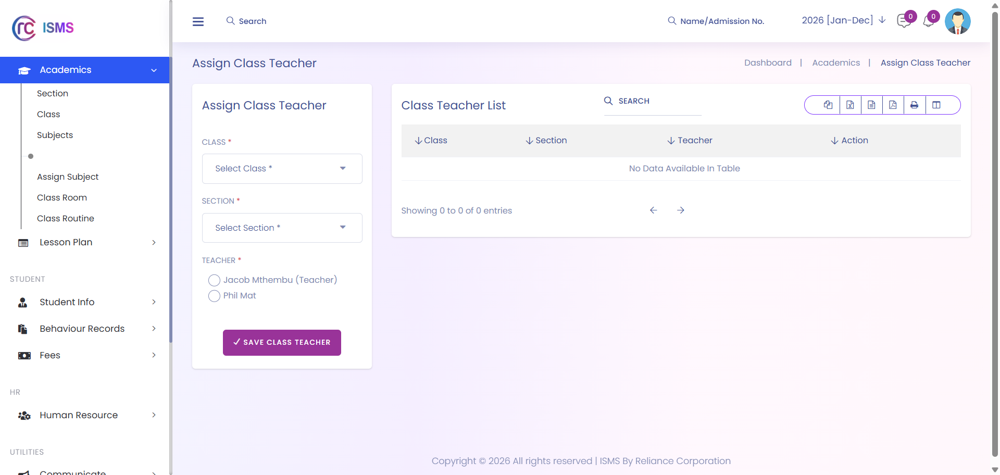

*   **Navigation:** `Administration > Academics > Assign Class Teacher`.
*   **Action:** Select the **Class** and **Section**, then check the radio button for the specific **Teacher**. Click `SAVE CLASS TEACHER`.

### **8. Assigning Subjects to Teachers**

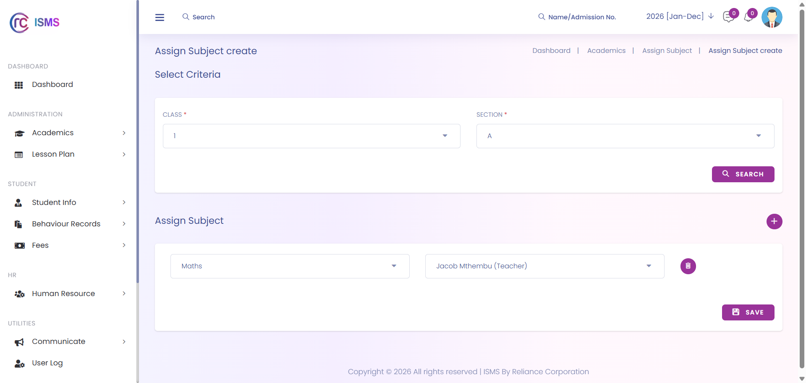

*   **Navigation:** `Administration > Academics > Assign Subject`.
*   **Action:** Select Class and Section, then hit `SEARCH`. 
*   **Mapping:** Click the **"+"** icon to add rows. Map each **Subject** to a specific **Teacher**. Hit `SAVE`.

### **9. Managing Class Rooms**

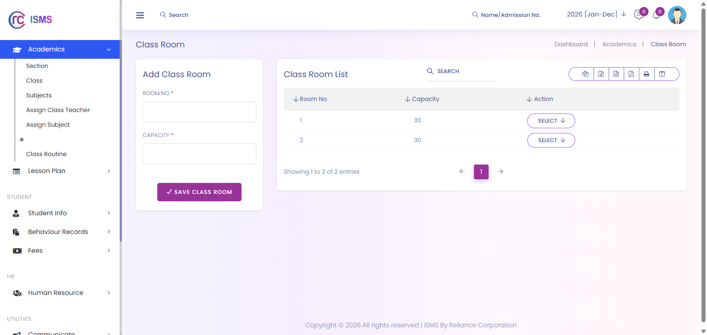

*   **Navigation:** `Administration > Academics > Class Room`.
*   **Action:** Enter the **Room No** and student **Capacity**. Use the list on the right to manage existing rooms.

### **10. Class Routine (Time Table)**

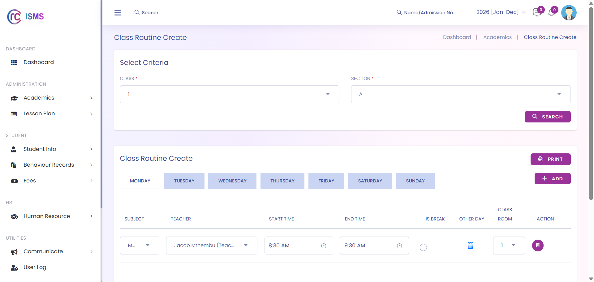

*   **Navigation:** `Administration > Academics > Class Routine`.
*   **Action:** Select Class/Section and hit `SEARCH`.
*   **Weekly View:** Navigate through tabs (**Monday to Sunday**). Click `ADD` to create a period row.
*   **Fields:** Select Subject, Teacher, Start/End Time, and Room.
*   **Features:** 
    *   **Is Break:** Check this for lunch or recess.
    *   **Other Day:** Click the **Calendar Icon** to copy this specific row to other days of the week.
    *   **Delete:** Use the **Bin Icon** to remove a period.
*   **Output:** Use the `PRINT` button to generate the schedule for the selected class.

---

## **Phase 3: Lesson Planning**

### **11. Adding Lessons**

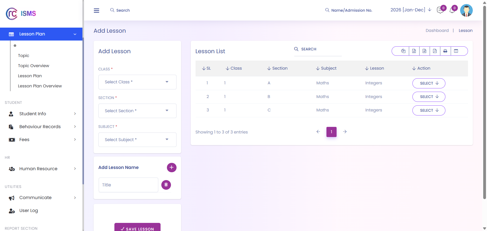

*   **Navigation:** `Administration > Lesson Plan > Lesson`.
*   **Action:** Select Class, Section, and Subject. 
*   **Bulk Add:** Use the `+` icon to add multiple **Lesson Titles** at once. These lessons will apply to the subject across all sections of that class.

### **12. Managing Topics**

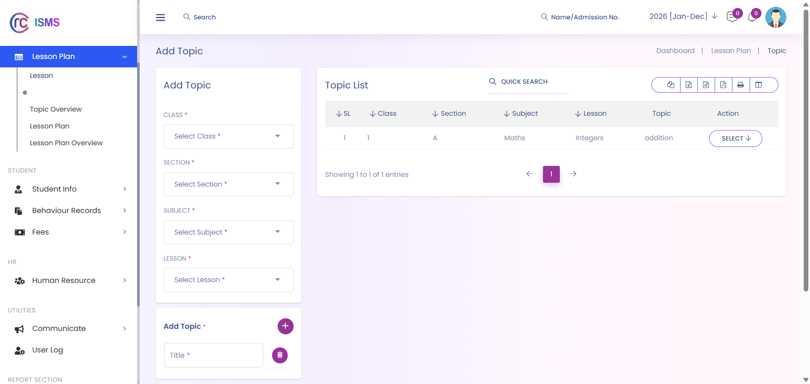

*   **Navigation:** `Administration > Lesson Plan > Topic`.
*   **Action:** Select the Class, Section, Subject, and the previously created **Lesson**. Enter specific **Topic Names** (e.g., "Addition," "Subtractions").

### **13. Topic Overview**

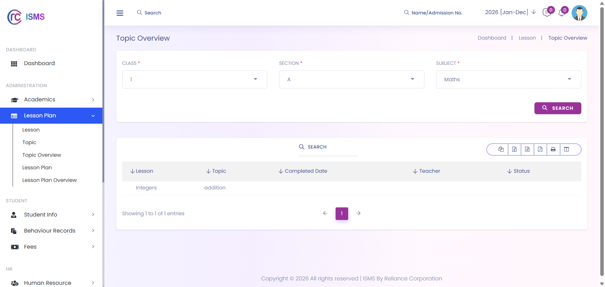

*   **Navigation:** `Administration > Lesson Plan > Topic Overview`.
*   **Purpose:** View a status report of all topics for a selected class/subject, showing the assigned teacher and **Completed Date**.

### **14. Creating Lesson Plans**

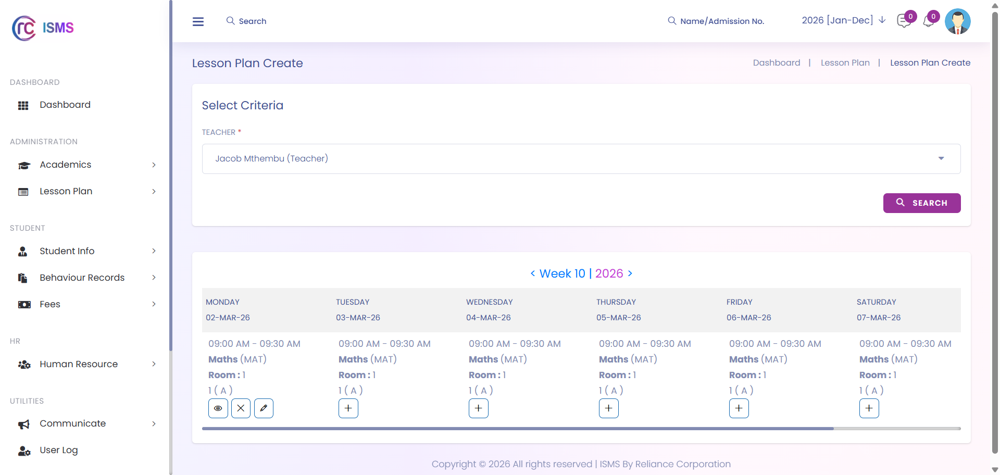

*   **Navigation:** `Administration > Lesson Plan > Lesson Plan`.
*   **Prerequisite:** Class Routine and Subjects must be assigned first.
*   **Action:** On the weekly calendar view, click the **"+" icon** in any period. Link the specific **Lesson** and **Topic** to be taught in that time slot.

### **15. Lesson Plan Overview (Tracking)**

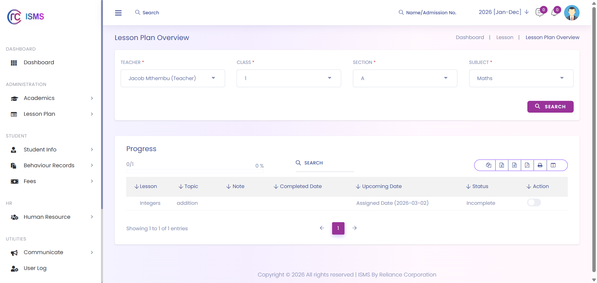

*   **Navigation:** `Administration > Lesson Plan > Lesson Plan Overview`.
*   **Tracking:** Select Teacher/Class/Subject to see a **Progress Bar (%)**. Use the **Status Toggle** to mark lessons as complete.

---

## **Phase 4: Student Life Cycle**

### **16. Admitting Students**

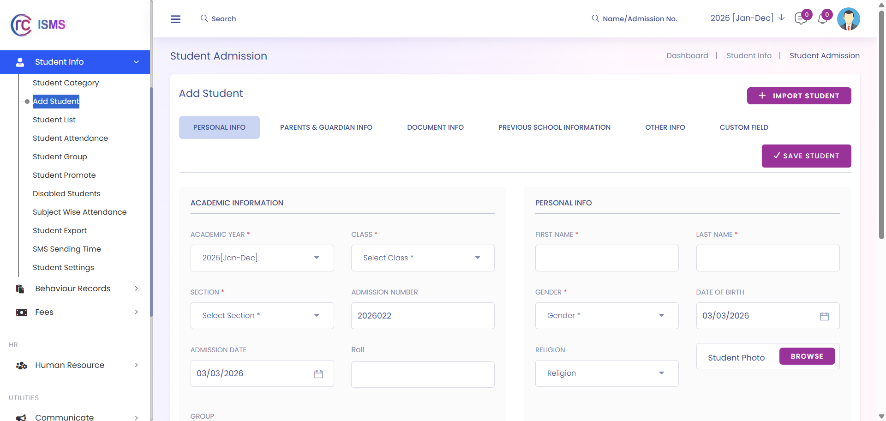

*   **Navigation:** `Student > Student Info > Add Student`.
*   **Action:** Fill in **Personal Info** (Name, DOB, Photo) and **Parents & Guardian Info**. 
*   **Account Logic:** Valid emails will trigger an invite to create Student and Parent accounts.
*   **Meta Data:** Use the `Student Category` and `Student Group` submenus to define custom groups (e.g., "Scholarship," "Bus Users").

### **17. Student List Management**

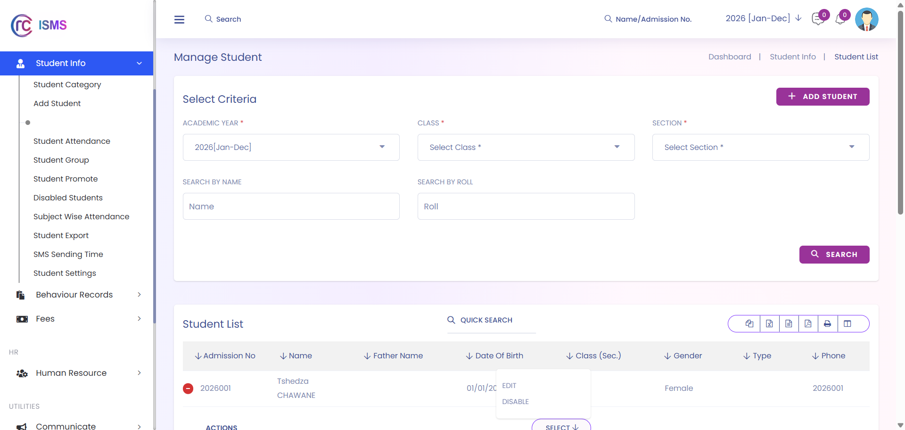

*   **Navigation:** `Student > Student Info > Student List`.
*   **Action:** Filter by Year, Class, or Section. Use the `SELECT` dropdown on a student row to **Edit** or **Disable** their record.

### **18. Managing Disabled Students**

*   **Navigation:** `Student > Student Info > Disabled Students`.
*   **Action:** View inactive records. You have the option to **Restore** them to active status or **Delete Permanently**.

### **19. Student Attendance**

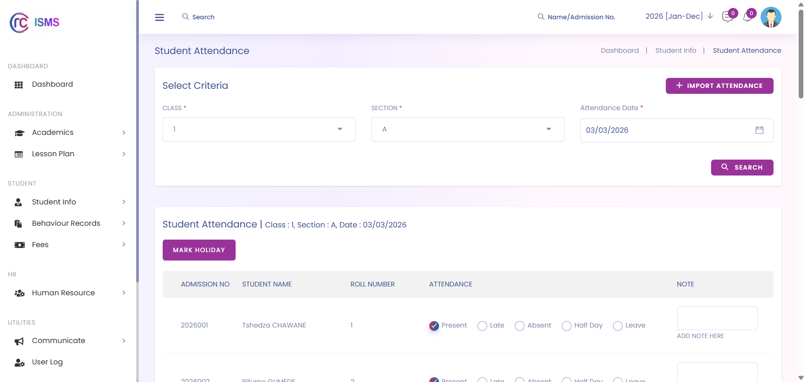

*   **Navigation:** `Student > Student Info > Student Attendance`.
*   **Daily Marking:** Select Class/Section/Date. Mark students as **Present, Late, Absent, Half Day, or Leave**. Add a **Note** if required.
*   **Holiday:** Click `MARK HOLIDAY` to exclude the entire class from attendance for that day.

### **20. Subject-Wise Attendance**

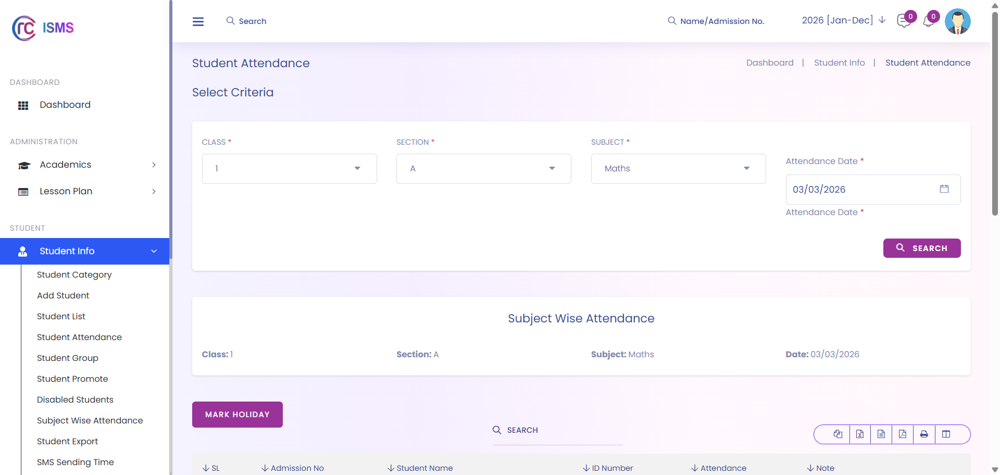

*   **Navigation:** `Student > Student Info > Subject Wise Attendance`.
*   **Purpose:** Take attendance for a specific subject period. Select Class, Section, Subject, and Date to record.

### **21. Student Promote**

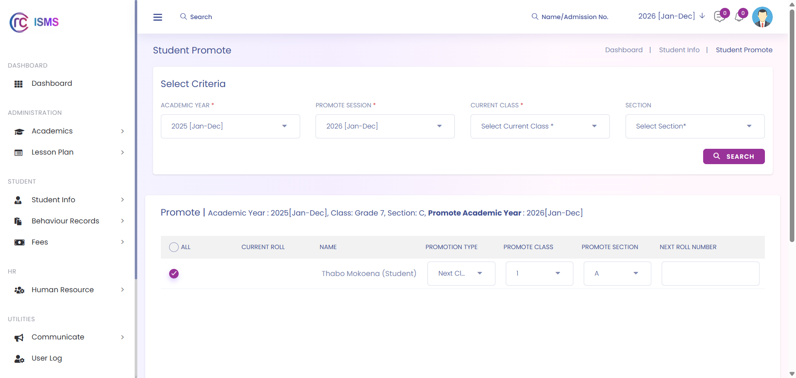

*   **Navigation:** `Student > Student Info > Student Promote`.
*   **End of Year:** Select the **Current Academic Year** and the **Promote Session** (next year). Choose the student and assign their **Promote Class/Section** and **Next Roll Number**.

### **22. Student Export**

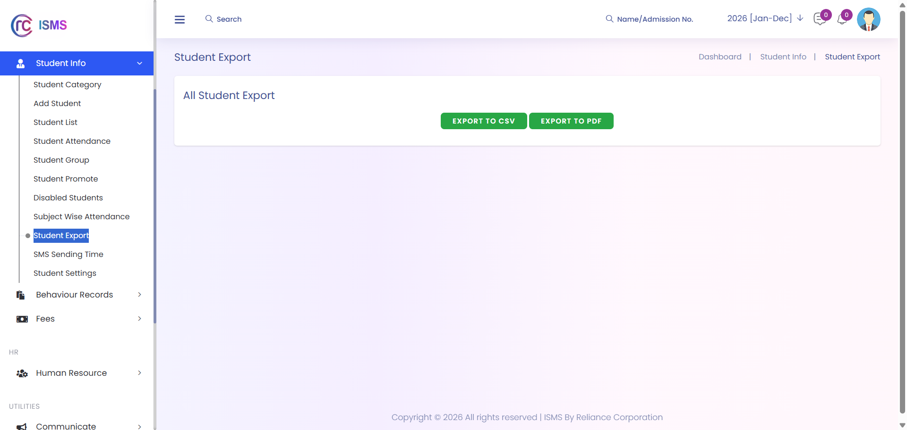

*   **Navigation:** `Student > Student Info > Student Export`.
*   **Action:** Click `EXPORT TO CSV` or `EXPORT TO PDF` to download the complete student directory.

---

## **Phase 5: Customization & Behaviour**

### **23. Student Settings (Field Control)**

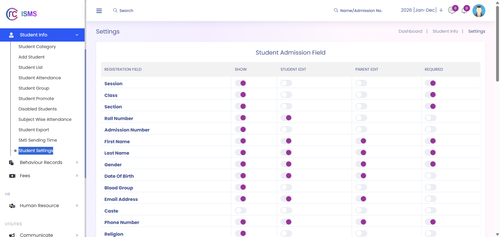

*   **Navigation:** `Student > Student Info > Student Settings`.
*   **Control:** Use Toggles to:
    *   **Show:** Make field visible.
    *   **Edit:** Allow Students/Parents to change info.
    *   **Required:** Make the field mandatory during registration.

### **24. Custom Fields (Registration)**

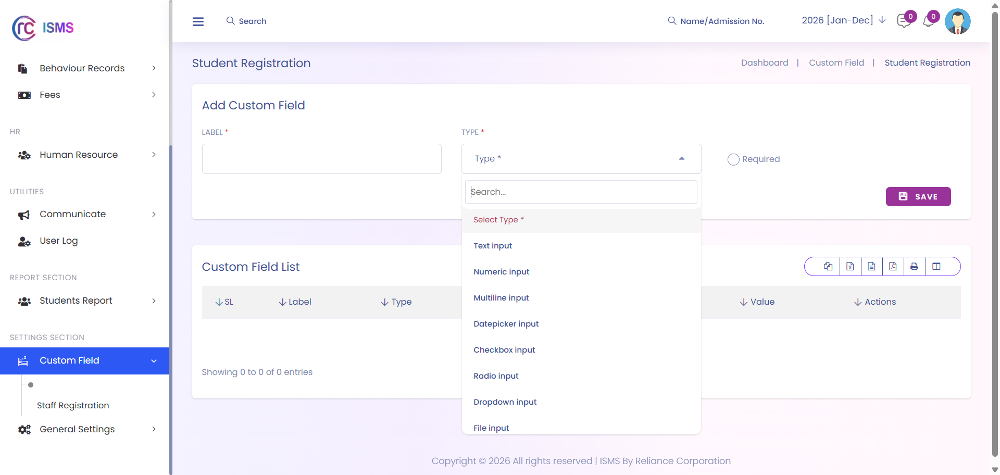

*   **Navigation:** `Settings Section > Custom Field > Student Registration` (or Staff Registration).
*   **Action:** Add fields like "Allergies" or "Bus Route."
*   **Types:** Select from **Text, Numeric, Multiline, Datepicker, Checkbox, Radio, Dropdown, or File input**.

### **25. Behaviour Incidents Setup**

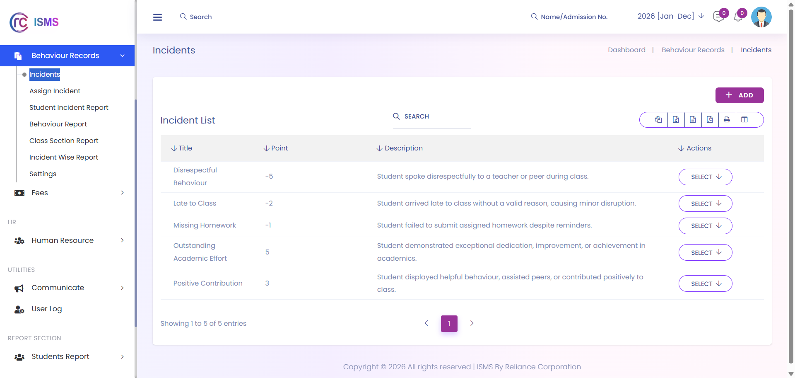

*   **Navigation:** `Student > Behaviour Records > Incidents`.
*   **Action:** Create a library of incidents. Assign a **Point** value (Positive for rewards, Negative for penalties).

### **26. Assigning Incidents**

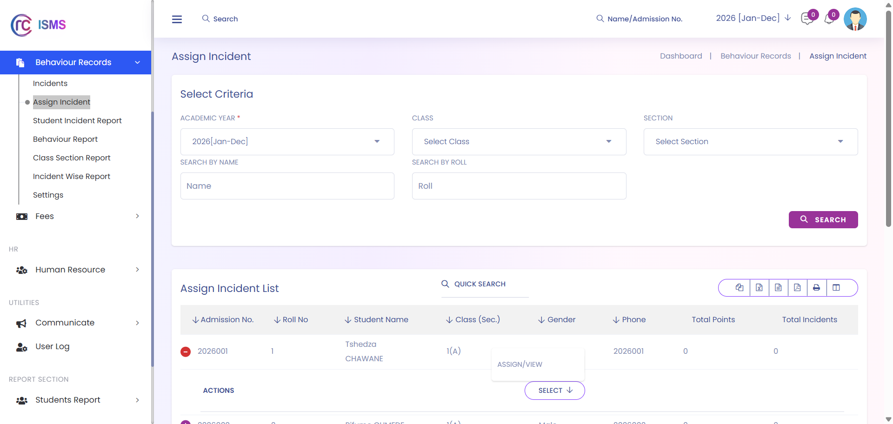

*   **Navigation:** `Student > Behaviour Records > Assign Incident`.
*   **Action:** Search for a student. Assign an incident to modify their **Total Points** and record the event.

### **27. Behaviour Reporting**

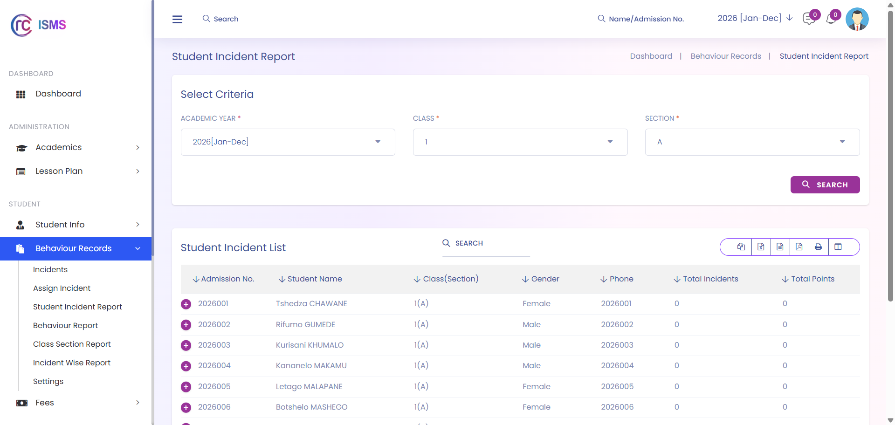

*   **Navigation:** Access submenus like `Student Incident Report` or `Class Section Report` to analyze behaviour trends via the provided list views.

---

## **Phase 6: Fees & Finance**

### **28. Fees Setup**

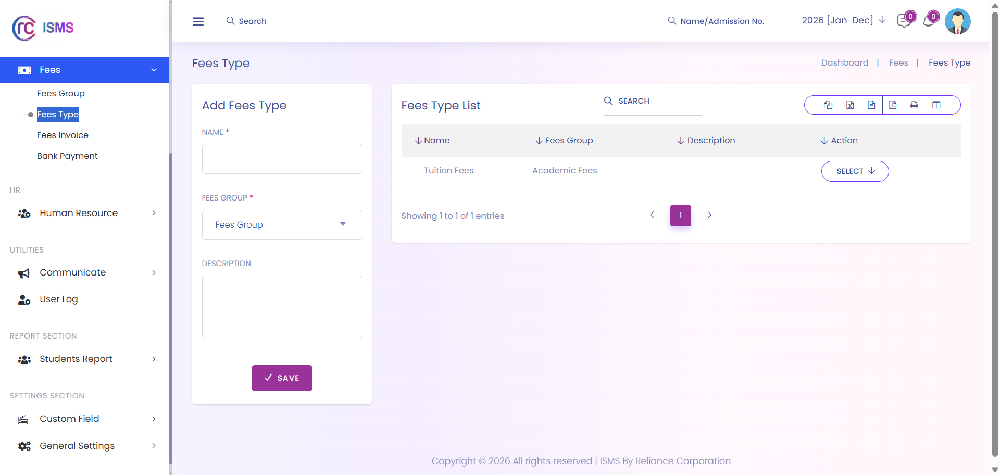

*   **Navigation:** `Student > Fees > Fees Group` and `Fees Type`.
*   **Logic:** Every `Fees Type` (e.g., "Tuition Fee") must belong to a `Fees Group` (e.g., "Academic Fees"). Set these up first.

### **29. Creating Fees Invoices**

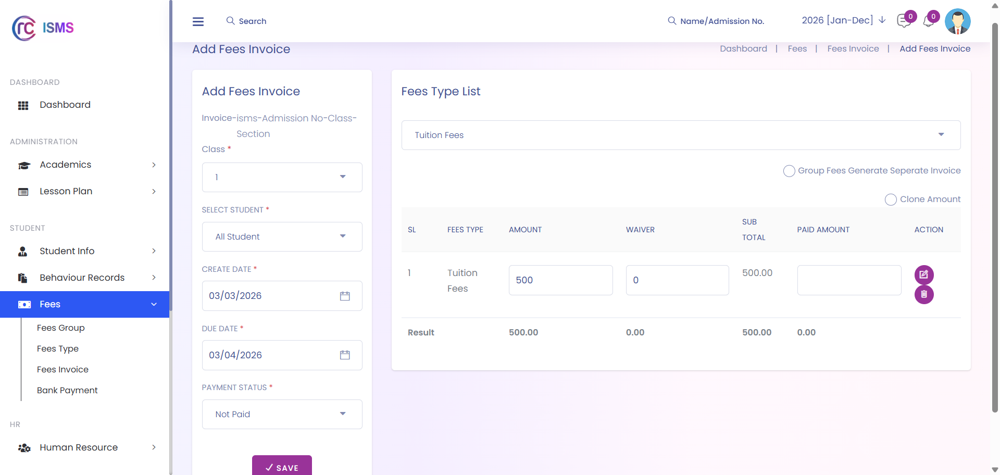

*   **Navigation:** `Student > Fees > Fees Invoice > Add`.
*   **Action:** Select Class. In **Select Student**, choose "All Student" for bulk billing or an individual. 
*   **Details:** Set Create Date, **Due Date (Future)**, and Payment Status. Add multiple Fee Types to the table.

### **30. Invoice Management**

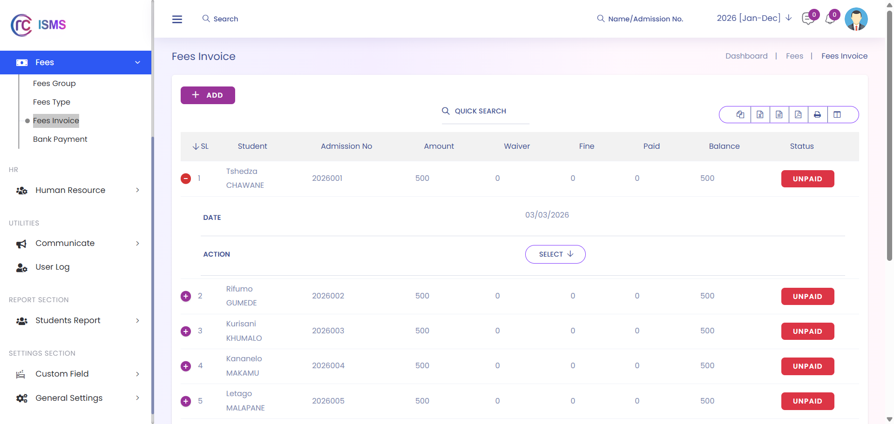

*   **Navigation:** `Student > Fees > Fees Invoice`.
*   **Action:** Use the list to track Unpaid/Paid status. The `SELECT` button allows you to add payments or delete the invoice.

### **31. Bank Payments**

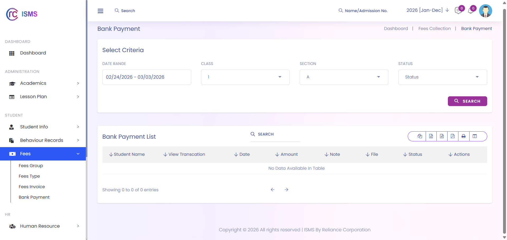

*   **Navigation:** `Student > Fees > Bank Payment`.
*   **Action:** Approve or reject payments made via bank transfer. *Note: Banks must be configured in the Accounts menu first.*

---

## **Phase 7: Communication & Reporting**

### **32. Staff Directory**

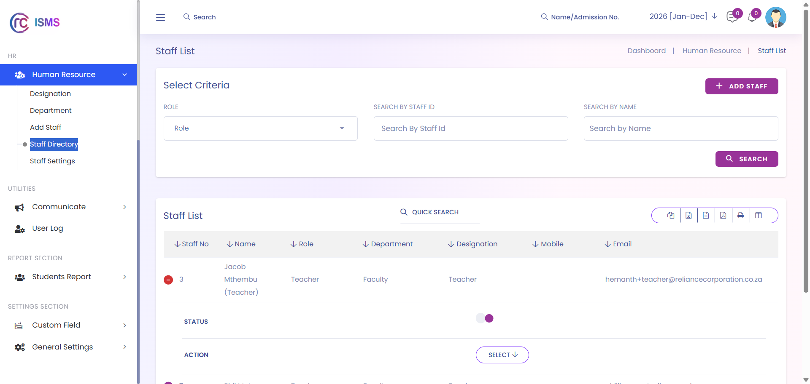

*   **Navigation:** `HR > Human Resource > Staff Directory`.
*   **Action:** Use this to filter, edit, or disable staff members. Use the icons to export staff data.

### **33. Staff Settings**

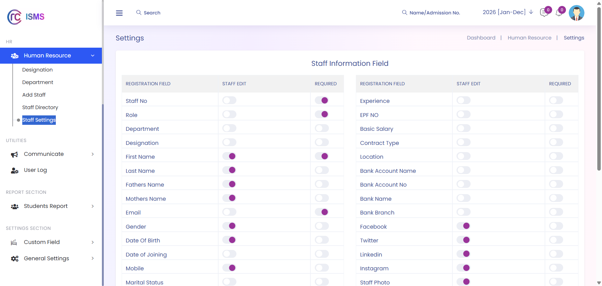

*   **Navigation:** `HR > Human Resource > Staff Settings`.
*   **Action:** Manage field visibility and edit permissions for staff profiles.

### **34. Notice Board**

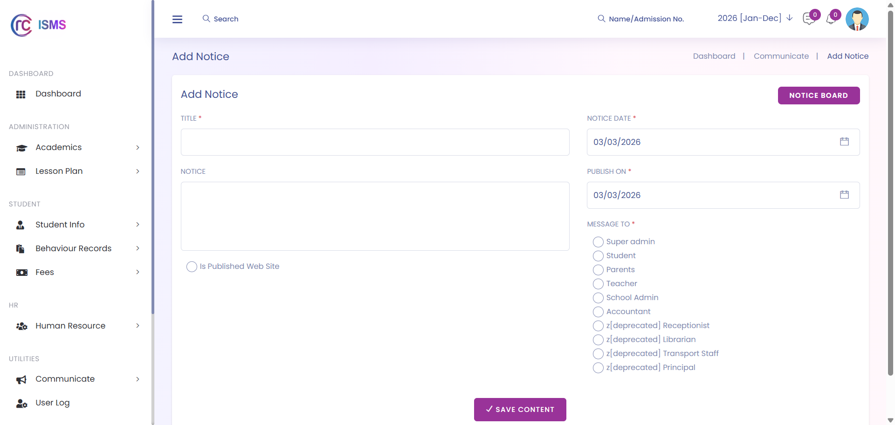

*   **Navigation:** `Utilities > Communicate > Notice Board`.
*   **Action:** Click `ADD NOTICE`.
*   **Fields:** Enter Title and Notice content. Select **Notice Date** and **Publish On** date.
*   **Message To:** Check boxes for Super Admin, Student, Parents, Teacher, etc.
*   **Web Site:** Check "Is Published Web Site" to show it on the public portal.

### **35. Send Email / SMS (Broadcasting)**

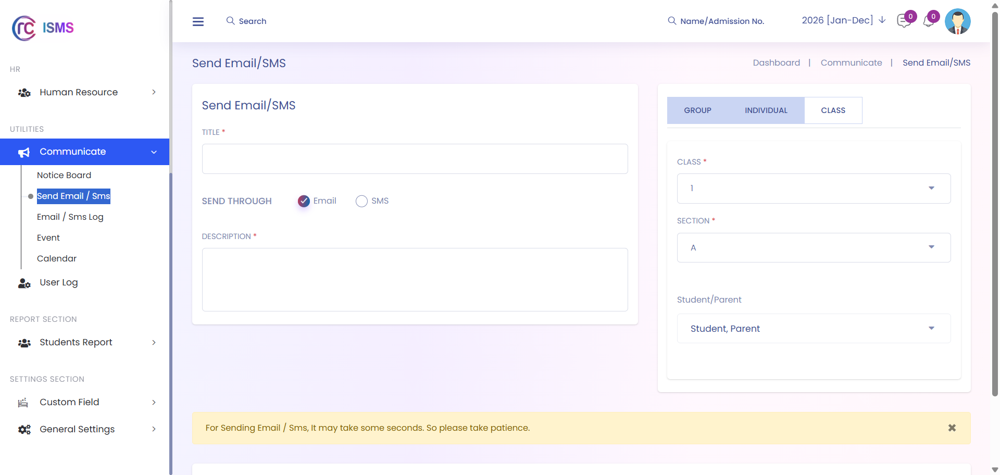

*   **Navigation:** `Utilities > Communicate > Send Email / Sms`.
*   **Tabs:** Switch between **GROUP** (Roles), **INDIVIDUAL**, or **CLASS**.
*   **Action:** Select "Email" or "SMS" radio button. 
*   **Prerequisite:** SMTP must be set in `Email Settings` and API in `SMS Settings`.
*   **Log:** Track all sent messages in the `Email / Sms Log` submenu.

### **36. Event Management**

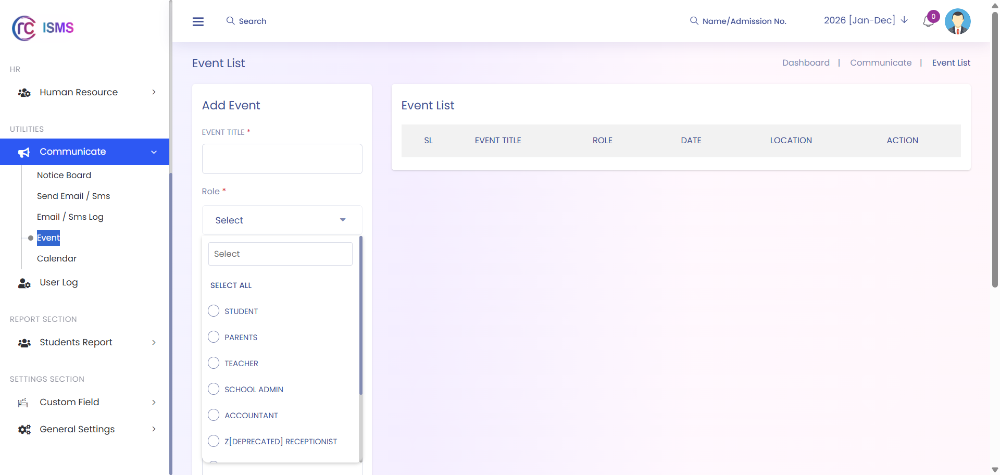

*   **Navigation:** `Utilities > Communicate > Event`.
*   **Action:** Create events that populate the calendars of selected **Roles**. 
*   **Shortcut:** You can also create these by clicking a date on the **Dashboard Calendar**.

### **37. Student Reports**

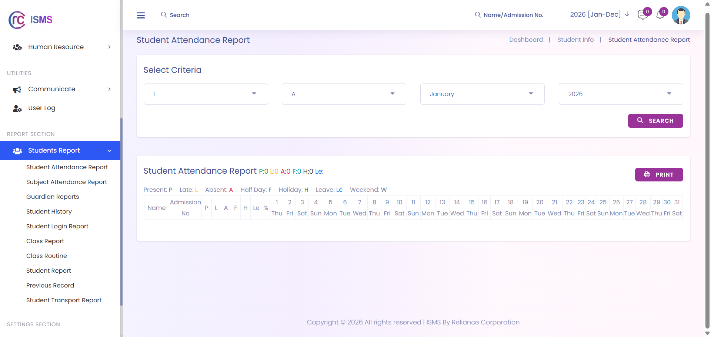

*   **Navigation:** `REPORT SECTION > Students Report`.
*   **Available Reports:** Attendance (see screenshot for color-coded monthly view), Subject Attendance, Guardian Reports, Login Logs, etc.

### **38. General System Settings**

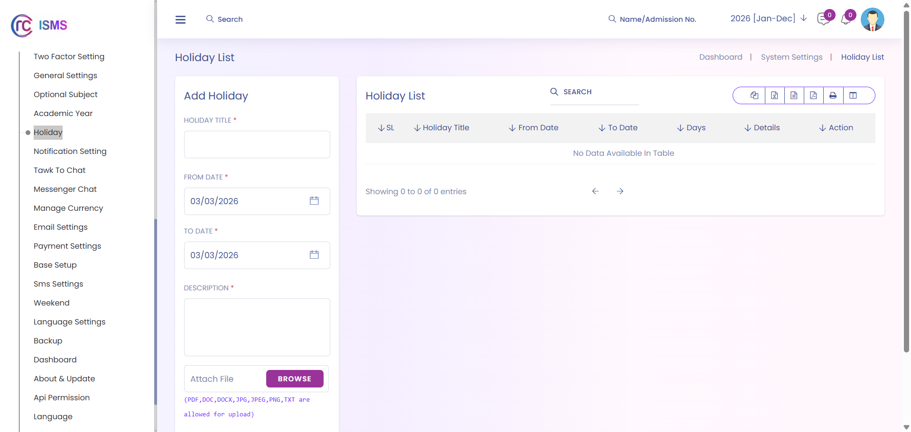

*   **Navigation:** `SETTINGS SECTION > General Settings`.
*   **General Settings:** Basic school info and SMTP/SMS configurations.
*   **Academic Year:** (Refer to point 2.5).
*   **Holidays:** Use the `Holiday` submenu to add titles and date ranges (e.g., Summer Break). Use the **Browse** button to attach supporting documents.
*   **Weekend:** Use the `Weekend` submenu to select which days (e.g., Saturday/Sunday) are non-working days.

---

[← Back to Index](index.md)

**End of Admin Manual**